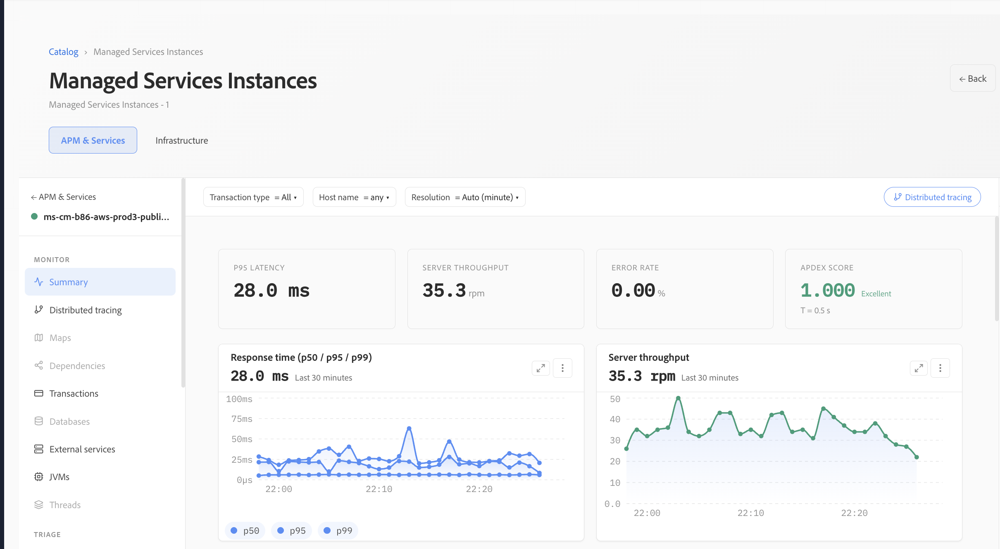

# Anwendungen

Anwendungen bieten Funktionen zur Anwendungsleistungsüberwachung (Application Performance Monitoring, APM), die einen einheitlichen Überblick über den Zustand, die Leistung, Transaktionen und die zugrunde liegende Infrastruktur bieten, die jeden Service unterstützt. Es hilft Operations- und Engineering-Teams, das Anwendungsverhalten zu verstehen, Leistungsengpässe zu identifizieren und von allgemeinen Gesundheitsindikatoren zu einzelnen Transaktionen zu wechseln, um tiefere Untersuchungen zu ermöglichen.

## Anwendungszusammenfassung

Die **Programme** Zusammenfassung bietet einen Überblick über das ausgewählte Programm. Wichtige Indikatoren wie p95-Latenz, Server-Durchsatz, Fehlerrate und Apdex erleichtern die Bewertung des Anwendungszustands über den ausgewählten Zeitraum.

Filter für Transaktionstyp, Host und Auflösung ermöglichen es, die Ansicht für eine bestimmte Untersuchung zu verfeinern. Die Entwicklungen von Reaktionszeiten und Durchsatz bieten zusätzlichen Kontext, sodass Teams isolierte Spitzen von anhaltenden Leistungsänderungen unterscheiden können.

## Antwortzeit, Durchsatz und Apdex

Die Anwendungsleistung kann mithilfe der prozentualen Antwortzeiten neben dem Anforderungsdurchsatz bewertet werden. Durch die Anzeige der Latenz von p50, p95 und p99 können typische Benutzererlebnisse von langsameren Ausreißern unterschieden werden.

Apdex bietet ein komplementäres Maß für die Reaktionsfähigkeit von Anwendungen, indem es die Reaktionszeitleistung in einen leicht verständlichen Zufriedenheitswert übersetzt. Zusammen mit der Fehlerrate bieten diese Metriken einen präzisen Hinweis darauf, ob eine Anwendung innerhalb der erwarteten Leistungsniveaus funktioniert.

## Fehler und langsame Transaktionen

Anwendungen zeigen kontinuierlich Trends mit Fehlerquoten und langsame Transaktionen auf, um Anforderungen zu identifizieren, die die Anwendungsleistung beeinträchtigen können. Die Fehlerratenansicht erleichtert die Erkennung von Änderungen im Laufe der Zeit, während der Apdex-Trend die entsprechenden Auswirkungen auf die Reaktionsfähigkeit von Anwendungen zeigt.

Die Ansicht **Langsamste Transaktionen** zeigt Transaktionen mit der höchsten durchschnittlichen Dauer an und enthält das Aufrufvolumen, wodurch die Unterscheidung zwischen häufig ausgeführten Workloads und isolierten langsamen Anfragen erleichtert wird.

## Transaktions- und Infrastrukturkorrelation

Die Transaktionsliste bietet eine fokussierte Ansicht der langsamsten Transaktionstypen, einschließlich ihrer langsamsten beobachteten Verfolgung, Fehlerrate und durchschnittlichen Dauer. Auf diese Weise können Teams schnell Transaktionsmuster identifizieren, die weitere Untersuchungen rechtfertigen.

Anwendungsdaten werden mit den zugrunde liegenden Hosts korreliert, sodass die Transaktionsleistung zusammen mit Infrastrukturindikatoren wie Antwortzeit, Durchsatz, CPU-Auslastung und Speicherauslastung bewertet werden kann. Diese Korrelation hilft bei der Bestimmung, ob ein Leistungsproblem von der Anwendungsverarbeitung ausgeht oder mit der unterstützenden Infrastruktur verbunden sein kann.

## Analyse der Transaktionsleistung

In der Ansicht „Transaktionsanalyse“ werden Transaktionen nach Leistungsmerkmalen sortiert. Außerdem werden wichtige Indikatoren wie die zeitaufwendigste Transaktion, die langsamste p95-Antwortzeit, die höchste Fehlerrate, der Durchsatz und Apdex zusammengefasst.

Zeitreihenvisualisierungen zeigen, wie die wichtigsten Transaktionen zur gesamten Verarbeitungszeit beitragen und wie sich der Anforderungsdurchsatz im ausgewählten Zeitraum ändert. Dies erleichtert die Identifizierung von Endpunkten mit hoher Auswirkung, den Vergleich des Transaktionsverhaltens und die Bestimmung, welche Anfragen zuerst untersucht werden sollten.

## Untersuchung von Leistungsproblemen

Anwendungen unterstützen einen progressiven Untersuchungs-Workflow: Beginnen Sie mit Zustands- und Leistungsindikatoren auf Anwendungsebene, identifizieren Sie abnormale Antwortzeiten, Fehler oder Durchsatzänderungen und grenzen Sie die Untersuchung auf die Transaktionen ein, die am meisten zum Problem beitragen. Transaktionsdaten können mit Infrastrukturmetriken auf Host-Ebene korreliert werden.

Dieser Workflow hilft Teams, effizient von **Trend bei Anwendungszustand → Leistung → → Hosts** zu wechseln, wodurch der Zeitaufwand für die Isolierung der Ursache eines Leistungsproblems reduziert wird.
