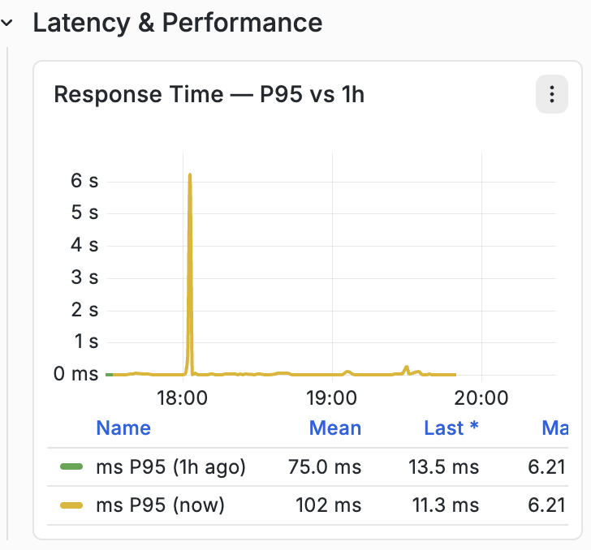

# APM-Dashboard-Referenz {#apm-dashboard-reference}

Diese Referenz dokumentiert die wichtigsten in AEM Managed Services verwendeten APM-Bedienfelder für Observability Insights.

## Dashboard-Navigation


Das Dashboard ist in erweiterbare Abschnitte unterteilt, die verwandte Anwendungsleistungsmetriken gruppieren. Wenn Sie einen Abschnitt erweitern, werden ein oder mehrere Diagramme angezeigt, die mit dieser Kategorie verknüpft sind.

## Überblick


### Beschreibung

Im Abschnitt **Übersicht** werden allgemeine Key Performance Indicators (KPIs) vorgestellt, die den aktuellen Status der überwachten Anwendung zusammenfassen.

Diese KPIs bieten eine Zusammenfassung der Anwendungsaktivität, des Durchsatzes, des Anfrageerfolgs und des gesamten Benutzererlebnisses auf einen Blick.

### Metrik

#### Anfragen insgesamt

Zeigt die Gesamtzahl der Anfragen an, die von der Anwendung während des ausgewählten Zeitraums verarbeitet wurden.

**metrisch**

```
total_requests
```

**Einheit**

- Anzahl

#### Stromdurchsatz

Zeigt die aktuelle Anforderungsverarbeitungsrate an.

**metrisch**

```
throughput
```

**Einheit**

- Anfragen pro Sekunde (req/s)

#### Aktuelle Fehlerrate

Zeigt den Prozentsatz der Anfragen an, die zu Fehlern geführt haben.

**metrisch**

```
error_rate
```

**Einheit**

- Prozentsatz (%)

#### APDEX-Wert

Zeigt den Anwendungs-Performance-Index (APDEX) an, einen standardisierten Messwert für die Endbenutzerzufriedenheit basierend auf den Antwortzeiten des Programms.

Der konfigurierte Schwellenwert wird innerhalb des Widgets angezeigt.

**metrisch**

```
apdex_score
```

**Einheit**

- Ergebnis (0,0 - 1,0)

## RED Metrics

Die RED-Methode misst drei Hauptmerkmale eines Antrags:

- **rate**
- **Fehler**
- **Dauer**

### Abfragerate


#### Beschreibung

Zeigt die Anzahl der im Laufe der Zeit empfangenen Anwendungsanfragen an.

Dieses Diagramm stellt den Anforderungsdurchsatz mithilfe einer Zeitreihenvisualisierung dar.

#### Metrik

```
req_min
```

#### Einheit

- Anfragen pro Minute (req/m)

#### Angezeigte Informationen

- Zeitreihen-Anfragerate
- Historische Anfrageaktivität
- Trend der Anfragerate
- Metriklegende

### Fehlerrate


#### Beschreibung

Zeigt den Prozentsatz der Anfragen an, die zu Fehlern geführt haben.

Das Diagramm vergleicht die historischen und aktuellen Fehlerprozentsätze.

#### Metrik

```
error_pct (now)
error_pct (1h ago)
```

#### Einheit

- Prozentsatz (%)

#### Angezeigte Informationen

- Aktueller Fehlerprozentsatz
- Historischer Vergleich
- Mittelwerte
- Zeitreihen-Trend

### Dauer der Anfrage


#### Beschreibung

Zeigt die Anfragelatenz für mehrere Antwortzeit-Perzentile an.

Das Diagramm zeigt gleichzeitig die Perzentil-Latenzmessungen, die während des ausgewählten Beobachtungszeitraums erfasst wurden.

#### Metrik

```
P50
P75
P90
```

#### Einheiten

- Millisekunden
- Sekunden (s)

Die Einheiten werden je nach Reaktionszeit automatisch skaliert.

#### Angezeigte Statistiken

Für jedes Perzentil:

- Mean
- Letzte
- Maximum

#### Perzentil-Definitionen

| Metrik | Beschreibung |
| ------ | ----------------------------- |
| P50 | &#x200B;50. Perzentil der Reaktionszeit |
| P75 | &#x200B;75. Perzentil der Reaktionszeit |
| P90 | &#x200B;90. Perzentil der Reaktionszeit |

## Traffic

### Anfragen nach HTTP-Status-Code


#### Beschreibung

Zeigt den Anfragedurchsatz gruppiert nach HTTP-Antwort-Status-Code an.

Jeder Status-Code wird unabhängig im Zeitverlauf dargestellt.

#### Metrik

Zu den gebräuchlichen Metriken gehören:

```
req_s 200
req_s 300
req_s 400
req_s 500
```

abhängig von der Anwendungsaktivität.

#### Einheit

- Anfragen pro Sekunde (req/s)

#### Angezeigte Informationen

- Durchsatz nach HTTP-Status
- Durchsatz
- Neuester Durchsatz
- Maximaler Durchsatz
- Zeitreihenaktivität

### Anfragerate nach Endpunkt


#### Beschreibung

Zeigt die Anwendungsendpunkte mit dem höchsten Traffic an, sortiert nach Anfragerate.

Jeder Endpunkt wird als horizontaler Balken angezeigt, der das Anfragevolumen darstellt.

#### Metrik

```
endpoint_request_rate
```

#### Einheit

- Anfragen pro Minute (req/m)

#### Angezeigte Informationen

- Endpunktpfad
- Anfragerate
- Ranking-Endpunktliste
- Relatives Anfragevolumen

## Latenz und Leistung

### Reaktionszeit — p95 vs. 1 Stunde



#### Beschreibung

Zeigt einen Vergleich der aktuellen P95-Antwortzeit mit der eine Stunde zuvor aufgezeichneten P95-Antwortzeit.

Beide Datensätze werden im selben Zeitreihendiagramm angezeigt.

#### Metrik

```
P95 (Current)
P95 (1 Hour Ago)
```

#### Einheiten

- Millisekunden
- Sekunden (s)

#### Angezeigte Statistiken

- Mean
- Letzte
- Maximum

### APDEX-Wert im Zeitverlauf


#### Beschreibung

Zeigt den Anwendungsleistungsindex als kontinuierliche Zeitreihe an.

Das Diagramm visualisiert APDEX-Werte über das gesamte ausgewählte Überwachungsintervall.

#### Metrik

```
APDEX Score
```

#### Einheit

- Ergebnis (0,0-1,0)

#### Angezeigte Statistiken

- Mean
- Letzte
- Maximum

### Durchsatz vs. P95-Latenz


#### Beschreibung

Zeigt den Anfragedurchsatz und die P95-Antwortlatenz auf derselben Zeitleiste an.

Das Diagramm ermöglicht die gleichzeitige Visualisierung des Traffic-Volumens und der Reaktionslatenz.

#### Metrik

```
Throughput
P95 Latency
```

#### Einheiten

| Metrik | Einheit |
| ----------- | ------------ |
| Durchsatz | Anfragen/Sek. |
| P95-Latenz | Millisekunden |

#### Angezeigte Informationen

- Durchsatz der Zeitreihe
- Zeitreihenlatenz
- Vergleich zweier Metriken

## Fehlerdetails

### Fehlerrate % nach Statusgruppe


#### Beschreibung

Zeigt die Prozentsätze der Anwendungsfehler gruppiert nach HTTP-Antwortklasse an.

Für jede Antwortkategorie werden separate Reihen dargestellt.

#### Metrik

Häufige Gruppen sind:

```
2xx
3xx
4xx
5xx
Combined Error Trend
```

abhängig vom beobachteten Traffic.

#### Einheit

- Prozentsatz (%)

#### Angezeigte Informationen

- Fehlerprozentsatz nach Antwortklasse
- Mittlerer Fehlerprozentsatz
- Zeitreihen-Trend

### Trend der Fehlerrate - jetzt vs. vor 1 Stunde


#### Beschreibung

Zeigt das aktuelle Fehlerverhältnis neben dem eine Stunde zuvor aufgezeichneten Fehlerverhältnis an.

#### Metrik

```
Current Error Ratio
1 Hour Error Ratio
```

#### Einheit

- Prozentsatz (%)

#### Angezeigte Informationen

- Aktueller Trend
- Historischer Vergleich
- Zeitreihenvisualisierung

### Trend der Fehlerrate - jetzt vs. vor 6 Stunden


#### Beschreibung

Zeigt das aktuelle Fehlerverhältnis neben dem sechs Stunden zuvor aufgezeichneten Fehlerverhältnis an.

#### Metrik

```
Current Error Ratio
6 Hour Error Ratio
```

#### Einheit

- Prozentsatz (%)

#### Angezeigte Informationen

- Aktuelles Fehlerverhältnis
- Historischer Vergleich
- Zeitreihenvisualisierung

## Zusammenfassung der Dashboard-Metriken

| Dashboard | Primäre Metriken |
| -------------------------- | --------------------------------------------- |
| Überblick | Anfragen insgesamt, Durchsatz, Fehlerrate, APDEX |
| Abfragerate | Anfragen pro Minute |
| Fehlerrate | Fehlerrate |
| Dauer der Anfrage | P50, P75, P90 Latenz |
| Anfragen nach Status-Code | Durchsatz des HTTP-Status |
| Anfragerate nach Endpunkt | Endpunkt-Anfragevolumen |
| Vergleich der Antwortzeiten | Aktueller vs. historischer P95 |
| APDEX-Wert | Benutzerzufriedenheitsindex |
| Durchsatz vs. Latenz | Anforderungsdurchsatz und P95-Latenz |
| Fehlerrate nach Statusgruppe | Fehlerprozentsatz der HTTP-Statusgruppe |
| Trends der Fehlerquote | Aktuelles vs. historisches Fehlerverhältnis |
