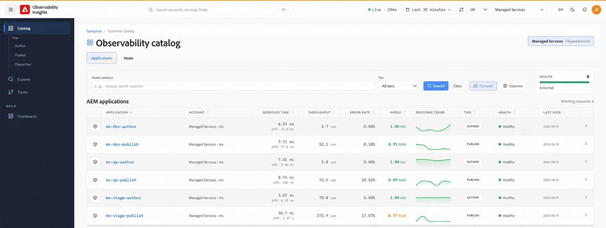

# Verwenden von Observability Insights {#use-observability-insights}

In diesem Abschnitt werden die täglichen Überwachungs- und Ermittlungs-Workflows behandelt, die Ihr Team am häufigsten verwendet. Sie sind in zwei Überwachungsbereiche unterteilt: Überwachung der Anwendungsleistung und Überwachung der Infrastruktur.

## Die Benutzeroberfläche von Observability Insights {#observability-insights-interface}

Der linke Navigationsbereich von Observability Insights bietet Ihnen Zugriff auf alle Überwachungsbereiche für Ihre AEM Managed Services-Umgebungen.

Die Navigation umfasst:

- **Katalog** - Zentrale Bestandsaufnahme der überwachten AEM-Anwendungen und -Hosts. Durchsuchen Sie Ressourcen auf **Autoren-, Veröffentlichungs- und Dispatcher**-Ebenen mit übersichtlichen Status- und wichtigen Leistungsindikatoren wie Antwortzeit, Durchsatz, Fehlerrate und Apdex.

- **Erkunden** - Untersuchung der Beobachtbarkeitstelemetrie und Aufschlüsselung der Leistungsdaten aller überwachten Ressourcen.

- **Traces** - Analysieren Sie End-to-End-Anwendungstransaktionen und fordern Sie Traces an, um Latenz, Fehler und Leistungsengpässe zu identifizieren.

- **Dashboards** - Greifen Sie auf kuratierte Dashboards zu, um Anwendungs- und Infrastruktursignale tiefer zu visualisieren und zu überwachen.

Die Ressourcen können nach Konto und Ebene gefiltert werden, während der Katalog eine konsolidierte Ansicht des Programm- und Hostzustands in der verwalteten AEM-Topologie bietet.

## Anwendungen{#applications}

Verwenden Sie [Anwendungen](applications.md) wenn das Problem anwendungsbezogen ist - langsame Seiten, steigende Fehlerquoten, instabile Transaktionen oder unerwartete Latenz bei der Autoren- oder Veröffentlichungsinstanz.

Programme helfen Ihnen bei der Beantwortung:

- Ist das Problem auf Autoren- und Veröffentlichungsebene beschränkt oder betrifft es beide Ebenen?
- Welche Endpunkte oder Transaktionen tragen am meisten zum Traffic und zu Verlangsamungen bei?
- Haben sich Latenz oder Fehler vor oder nach einer Bereitstellung oder Traffic-Spitze geändert?
- Zeigen Traces auf Repository-Vorgänge, externe Abhängigkeiten oder JVM-Druck?

Anwendungen instrumentieren AEM-Transaktionen bis hin zu Methodenaufrufen, externen Abhängigkeiten und Repository-Vorgängen, sodass Sie schnell von einem allgemeinen Symptom zu einem bestimmten Ausführungspfad wechseln können.

## Hosts {#hosts}

Verwenden Sie [Hosts](hosts.md), wenn Sie feststellen müssen, ob das Anwendungsverhalten durch Host-Ressourcenbedingungen - CPU-Sättigung, Speicherdruck, Datenträger-E/A, Netzwerkdurchsatz oder Speicherkapazität - verursacht oder erschwert wird.

Die Host-Überwachung hilft Ihnen bei der Beantwortung:

- Wird die verlangsamte Anwendungsperiode von CPU, Arbeitsspeicher oder I/O-Druck auf Host-Ebene begleitet?
- Verhält sich ein Host anders als andere in derselben Umgebung?
- Deuten die Trends bei der Festplatten- oder Speichernutzung auf ein bevorstehendes Kapazitätsproblem hin?
- Erklären Infrastrukturmuster das Anwendungsverhalten oder sind sie ein nachgelagerter Effekt?

Verwenden Sie Host-Dashboards zusammen mit Anwendungen, um zwischen Regressionen auf Anwendungsebene und Ressourcenbeschränkungen auf Umgebungsebene zu unterscheiden.

Beide Artikel enthalten Untersuchungs-Workflows, Fragen zur Klassifizierung und eine Liste von Beweisen, die bei der Eskalation an Adobe Managed Services erfasst werden müssen.
